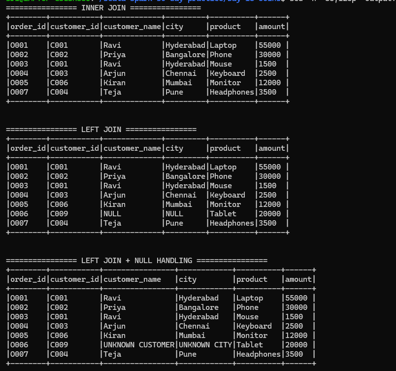
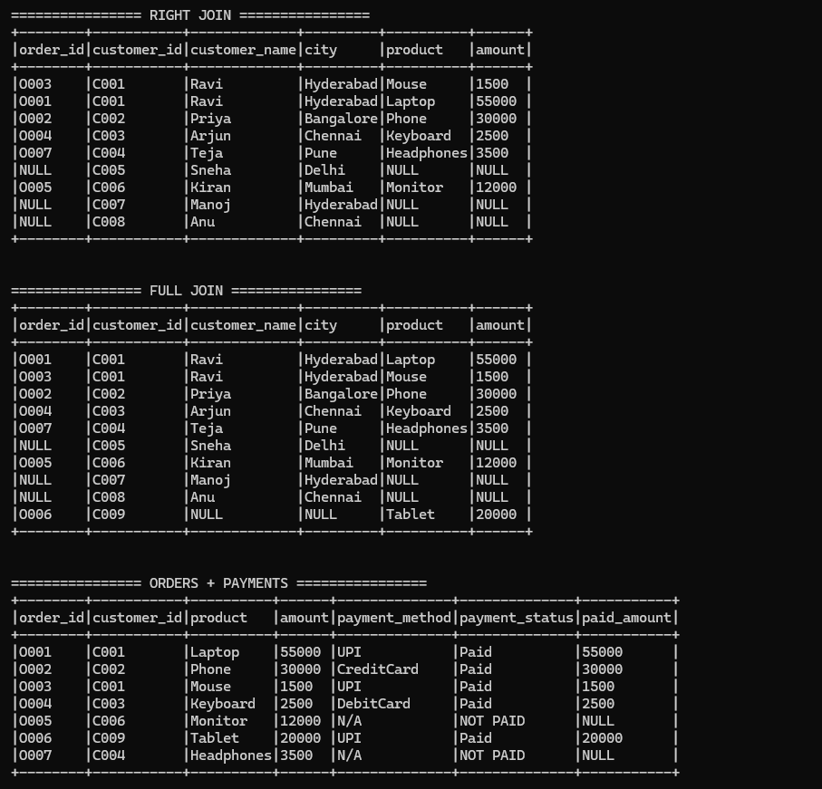
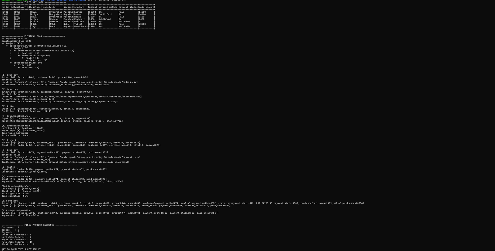

# Day 18 — Joins

## Objective

Practice Spark DataFrame joins by implementing inner, left, right, and full joins. Handle ambiguous column names with aliases, practice NULL handling after left joins, and understand the Shuffle Sort Merge Join concept.

## Scenario

This practice joins three datasets:
- Customers
- Orders
- Payments

The sample data is designed for the Day 18 join exercises.

## Project Structure

Day-18-Joins/
- data/customers.csv
- data/orders.csv
- data/payments.csv
- src/main/scala/Day18Joins.scala
- screenshots/day18-joins-1.png
- screenshots/day18-joins-2.png
- screenshots/day18-joins-3.png
- output.txt
- build.sbt
- project/build.properties

## Technologies

- Scala 2.12.18
- Apache Spark 3.5.3
- Spark SQL
- sbt 2.0.7
- Java 17

## Dataset Details

### Customers
Contains customer ID, name, city, and segment.

### Orders
Contains order ID, customer ID, product, amount, and order date.
The orders data contains customer C009, which does not exist in the customers dataset. This is used to demonstrate unmatched records.

### Payments
Contains payment ID, order ID, payment method, payment status, and paid amount.
The payments data contains order O999, which does not exist in the orders dataset. Orders O005 and O007 do not have matching payments, which is useful for NULL handling.

## Joins Implemented

### 1. Inner Join
Orders are joined with customers using customer_id. Only matching customer records are returned.
Result: 6 records.

### 2. Left Join
Orders are kept as the left dataset and customers are joined using customer_id. All 7 orders remain in the result. The unmatched C009 record produces NULL customer fields.
Result: 7 records.

### 3. NULL Handling
After the left join, coalesce() replaces NULL customer information:
- NULL customer name → UNKNOWN CUSTOMER
- NULL city → UNKNOWN CITY

### 4. Right Join
Customers are kept as the right-side dataset. All 8 customers are preserved, including customers who do not have orders.
Result: 9 records because customer C001 has two orders.

### 5. Full Join
A full join keeps unmatched records from both datasets, including customers without orders and orders without matching customers.
Result: 10 records.

### 6. Orders + Payments Left Join
Orders are joined with payments using order_id.
NULL payment information is handled with coalesce():
- NULL payment method → N/A
- NULL payment status → NOT PAID
- NULL paid amount → 0 in the final three-way result

### 7. Three-Way Join
The final dataset joins Orders → Customers → Payments.
Aliases used:
- o = orders
- c = customers
- p = payments

This avoids ambiguity when multiple datasets contain the same column names such as customer_id and order_id.

## Aliases and Ambiguous Columns

Aliases are used in join conditions. For example:

col("o.customer_id") === col("c.customer_id")

This explicitly identifies which dataset each column comes from.

## Shuffle Sort Merge Join

A Shuffle Sort Merge Join is a Spark join strategy where data is shuffled by the join key and sorted before matching records.

General process:
1. Shuffle records based on the join key.
2. Sort the records by the join key.
3. Merge matching sorted records.

Shuffle can be expensive because data may need to move between partitions across the cluster.

For this Day 18 sample, the actual physical plan selected by Spark used BroadcastHashJoin because the datasets are small. Therefore, this particular run should not be described as a Sort Merge Join.

## Physical Plan Observation

The final three-way join was inspected using finalJoin.explain("formatted").

The observed plan contained:
- AdaptiveSparkPlan
- BroadcastExchange
- BroadcastHashJoin
- Project
- CSV scans

Spark used BroadcastHashJoin for the small sample datasets.

## Transformations and Actions

### Transformations
- join()
- select()
- withColumn()
- coalesce()
- alias()

### Actions
- show()
- count()
- explain()

## Shuffle and Performance

Joins can create shuffle boundaries when Spark needs to redistribute data by join keys.

Possible optimizations include:
- Broadcasting small datasets when appropriate.
- Selecting only required columns before joins.
- Filtering unnecessary records early.
- Avoiding unnecessary shuffles.
- Choosing an appropriate join strategy based on data size.

In this run, Spark selected BroadcastHashJoin for the small datasets.

## Final Results

| Metric | Result |
|---|---:|
| Customers | 8 |
| Orders | 7 |
| Payments | 6 |
| Inner Join Records | 6 |
| Left Join Records | 7 |
| Right Join Records | 9 |
| Full Join Records | 10 |
| Final Joined Records | 7 |

## How to Run

From the Day-18-Joins directory:

    sbt compile
    sbt run

To save the output:

    sbt run > output.txt 2>&1

## Screenshots

### Join Results

### Right and Full Joins

### Three-Way Join and Physical Plan

## Completion

**DAY 18 COMPLETED SUCCESSFULLY**

The implementation covers the Day 18 requirements: inner, left, right, and full joins; aliases for ambiguous columns; NULL handling after left joins; a three-way orders-customers-payments join; and an explanation and inspection of Spark join execution.