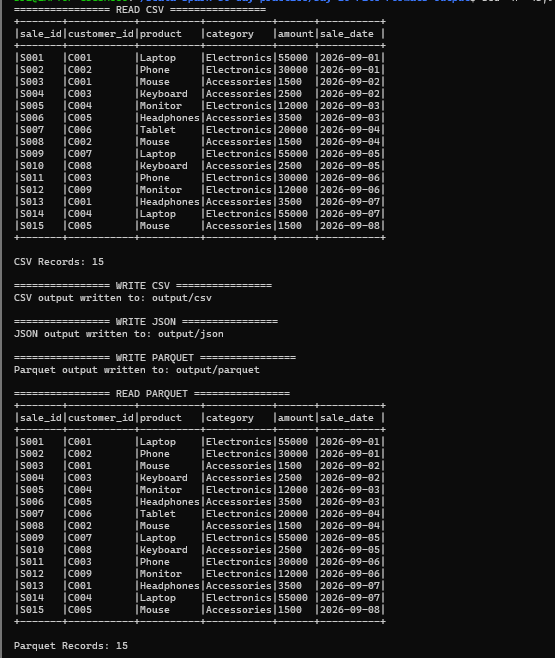
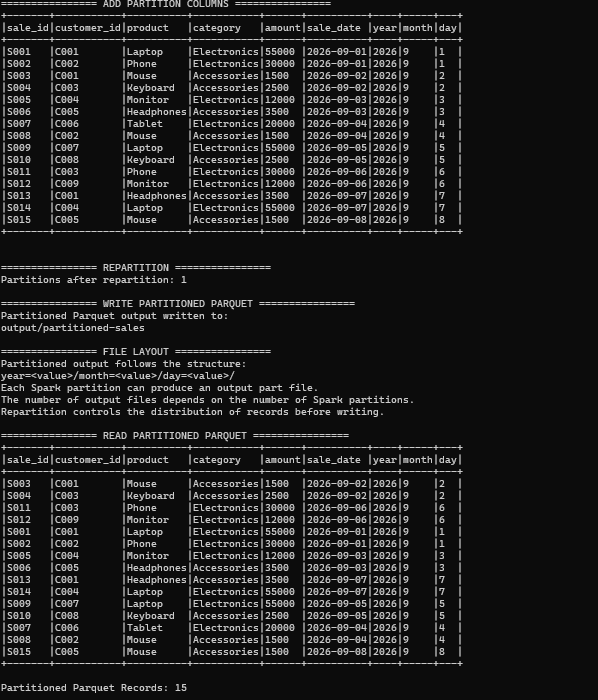
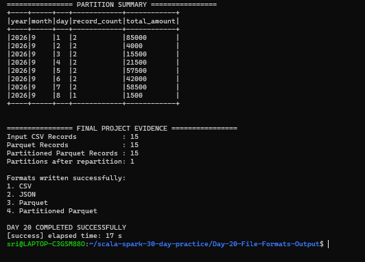

# Day 20 — File Formats and Output

## Objective

The objective of Day 20 is to practice Spark file formats and output handling.

This exercise covers:

- Reading and writing CSV
- Writing JSON
- Writing Parquet
- Writing partitioned output
- Understanding file layout and output files
- Using repartition before writing
- Storing daily sales partitioned by year, month, and day

---

## Project Structure

```text
Day-20-File-Formats-Output/
├── data/
│   └── daily_sales.csv
├── output/
│   ├── csv/
│   ├── json/
│   ├── parquet/
│   └── partitioned-sales/
├── project/
│   └── build.properties
├── screenshots/
│   ├── day20-file-formats-1.png
│   ├── day20-file-formats-2.png
│   └── day20-file-formats-3.png
├── src/
│   └── main/
│       └── scala/
│           └── Day20FileFormatsOutput.scala
└── build.sbt
```

---

## Input Dataset

The input file is:

```text
data/daily_sales.csv
```

It contains daily sales information with the following columns:

- `sale_id`
- `customer_id`
- `product`
- `category`
- `amount`
- `sale_date`

The dataset contains **15 sales records** covering **September 1 to September 8, 2026**.

---

## Implementation

### 1. Read CSV

Spark reads the input CSV with the header enabled and schema inference enabled. The program verifies the number of records after reading.

### 2. Write CSV

The input DataFrame is written to:

```text
output/csv/
```

### 3. Write JSON

The same DataFrame is written in JSON format to:

```text
output/json/
```

### 4. Write Parquet

The DataFrame is written in Parquet format to:

```text
output/parquet/
```

The program reads the Parquet data back and verifies the record count.

### 5. Create Partition Columns

The `sale_date` column is converted to a date and the following columns are created:

- `year`
- `month`
- `day`

This allows the sales data to be stored using a year/month/day partition layout.

### 6. Repartition Before Writing

The program uses:

```scala
repartition(col("year"), col("month"), col("day"))
```

This redistributes records based on the partition columns before writing.

For this small local dataset, Spark produced **1 partition after repartition**. This is the observed result for the current sample data and local execution.

### 7. Write Partitioned Parquet

The data is written using:

```scala
.partitionBy("year", "month", "day")
```

The output location is:

```text
output/partitioned-sales/
```

The resulting layout follows:

```text
year=<value>/month=<value>/day=<value>/
```

For this dataset, the output contains partitions from:

```text
year=2026/month=9/day=1
year=2026/month=9/day=2
year=2026/month=9/day=3
year=2026/month=9/day=4
year=2026/month=9/day=5
year=2026/month=9/day=6
year=2026/month=9/day=7
year=2026/month=9/day=8
```

Each partition contains its corresponding Parquet part file. Spark also creates normal output metadata such as `_SUCCESS` and CRC files.

---

## File Layout and Number of Output Files

Spark writes DataFrame output as directories rather than as one manually named file.

Typical output files include:

```text
part-00000-....csv
part-00000-....json
part-00000-....snappy.parquet
```

For partitioned output, the directory structure is based on the partition columns:

```text
partitioned-sales/
└── year=2026/
    └── month=9/
        ├── day=1/
        ├── day=2/
        ├── day=3/
        ├── day=4/
        ├── day=5/
        ├── day=6/
        ├── day=7/
        └── day=8/
```

The number of output part files depends on Spark's partitions and how records are distributed before writing. Repartitioning can be used to control that distribution.

---

## Results

The program successfully verified:

| Check | Result |
|---|---:|
| Input CSV records | 15 |
| Parquet records | 15 |
| Partitioned Parquet records | 15 |
| Spark partitions after repartition | 1 |

The daily partition summary was:

| Date | Records | Total Amount |
|---|---:|---:|
| 2026-09-01 | 2 | 85000 |
| 2026-09-02 | 2 | 4000 |
| 2026-09-03 | 2 | 15500 |
| 2026-09-04 | 2 | 21500 |
| 2026-09-05 | 2 | 57500 |
| 2026-09-06 | 2 | 42000 |
| 2026-09-07 | 2 | 58500 |
| 2026-09-08 | 1 | 1500 |

All four required output forms were successfully created:

1. CSV
2. JSON
3. Parquet
4. Partitioned Parquet

---

## Screenshots

### Screenshot 1 — CSV, JSON and Parquet



### Screenshot 2 — Partitioning and File Layout



### Screenshot 3 — Partition Summary and Final Evidence



---

## How to Run

From the Day 20 directory:

```bash
cd ~/scala-spark-30-day-practice/Day-20-File-Formats-Output
sbt run
```

To save the execution output:

```bash
sbt run > output.txt 2>&1
```

To inspect the generated files:

```bash
find output -maxdepth 5 -type f | sort
```

---

## Spark Concepts Practiced

- DataFrameReader
- DataFrameWriter
- CSV format
- JSON format
- Parquet format
- Partitioned output
- `partitionBy`
- `repartition`
- Spark partitions
- Output part files
- File and directory layout
- Reading Parquet back into Spark

---

## Final Status

**DAY 20 — FILE FORMATS AND OUTPUT COMPLETED SUCCESSFULLY**

The project demonstrates reading and writing multiple Spark file formats, partitioned daily sales output, repartitioning before writing, and inspection of the resulting file layout.
