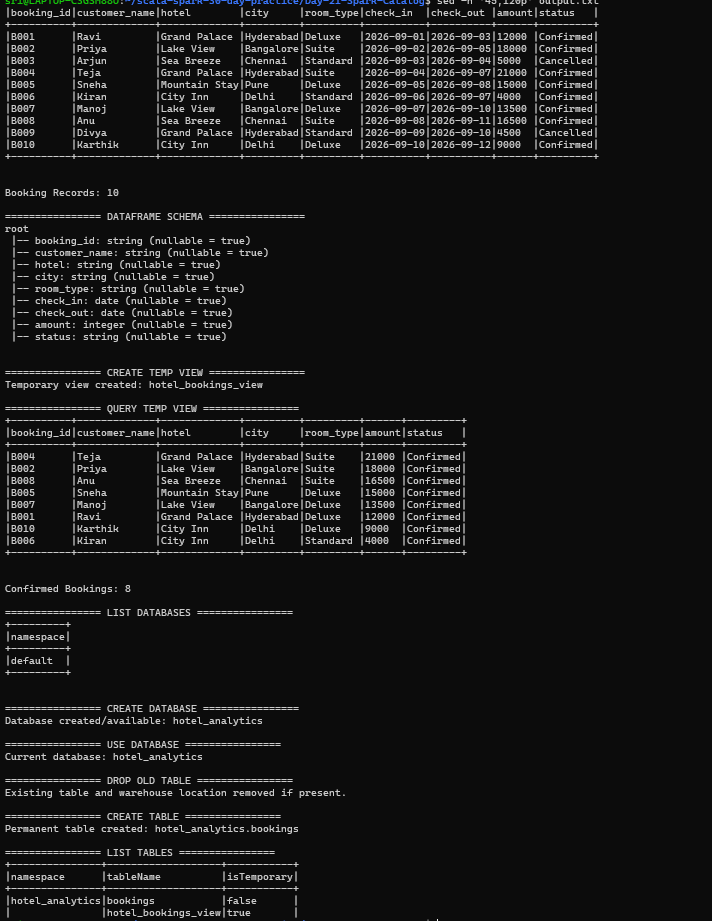
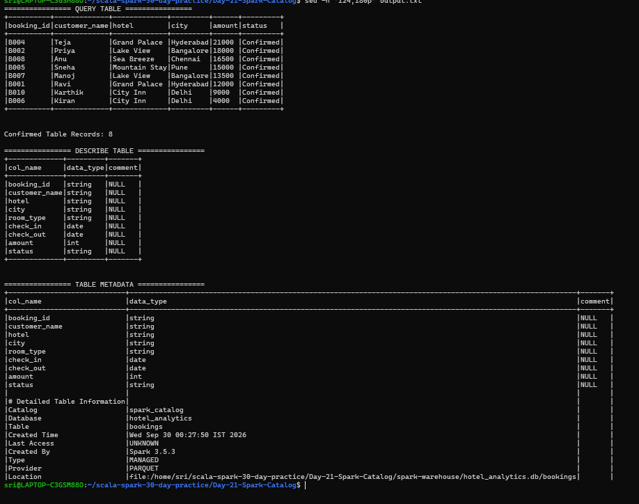
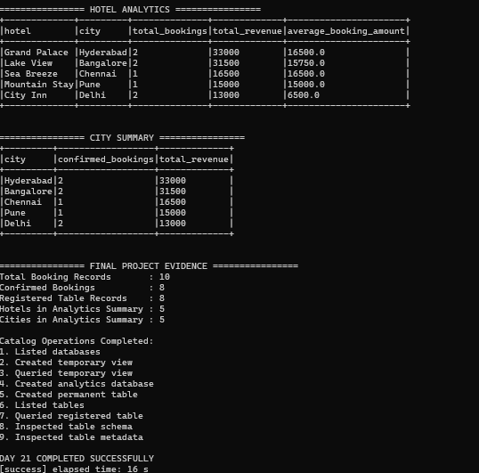

# Day 21 — Spark Catalog

## Objective

Practice Apache Spark Catalog operations using a small hotel booking analytics scenario.

This practice covers:
- Listing databases and tables
- Creating temporary views
- Registering and querying tables
- Inspecting table schema
- Inspecting table metadata
- Creating a small analytics database for hotel bookings

## Project Structure

```
Day-21-Spark-Catalog/
├── data/
│   └── hotel_bookings.csv
├── output.txt
├── screenshots/
│   ├── day21-spark-catalog-1.png
│   ├── day21-spark-catalog-2.png
│   └── day21-spark-catalog-3.png
├── project/
│   └── build.properties
├── src/main/scala/
│   └── Day21SparkCatalog.scala
└── build.sbt
```

## Dataset

The project uses `hotel_bookings.csv` containing 10 hotel booking records.

Columns:
- booking_id
- customer_name
- hotel
- city
- room_type
- check_in
- check_out
- amount
- status

## Spark Catalog Workflow

```
Hotel Booking CSV
       |
       v
Read DataFrame
       |
       v
Inspect Schema
       |
       v
Create Temporary View
       |
       v
Query Temporary View
       |
       v
List Databases
       |
       v
Create hotel_analytics Database
       |
       v
Create Permanent bookings Table
       |
       v
List Tables
       |
       v
Query Registered Table
       |
       v
Describe Table
       |
       v
Inspect Table Metadata
       |
       v
Hotel & City Analytics
```

## Implementation

### 1. Read Hotel Bookings

The CSV file is loaded into a Spark DataFrame using header, schema inference, and the `yyyy-MM-dd` date format.

### 2. Create Temporary View

A temporary SQL view named `hotel_bookings_view` is created and queried using Spark SQL.

### 3. Create Analytics Database

The program creates and uses the `hotel_analytics` database.

### 4. Create Permanent Table

A permanent managed table named `hotel_analytics.bookings` is created using Parquet.

### 5. Catalog Inspection

The program performs:
1. Listed databases
2. Created temporary view
3. Queried temporary view
4. Created analytics database
5. Created permanent table
6. Listed tables
7. Queried registered table
8. Inspected table schema
9. Inspected table metadata

## Results

- Total booking records: **10**
- Confirmed bookings: **8**
- Registered table records: **8**
- Hotels in analytics summary: **5**
- Cities in analytics summary: **5**

The registered table metadata shows:
- Database: `hotel_analytics`
- Table: `bookings`
- Type: `MANAGED`
- Provider: `PARQUET`

The program also produces hotel-level and city-level summaries using confirmed bookings.

## Tools and Technologies

- Apache Spark 3.5.3
- Scala 2.12.18
- sbt 2.0.7
- Java 17
- Spark SQL
- Parquet
- WSL2 / Ubuntu

## How to Run

From the project directory:

```bash
sbt compile
sbt run
```

To save the execution output:

```bash
sbt run > output.txt 2>&1
```

Successful execution ends with:

```
DAY 21 COMPLETED SUCCESSFULLY
```

## Screenshots

### Screenshot 1 — Data, Schema, Temporary View and Catalog



### Screenshot 2 — Table Query, Schema and Metadata



### Screenshot 3 — Analytics and Final Evidence



## Final Evidence

```
Total Booking Records       : 10
Confirmed Bookings          : 8
Registered Table Records    : 8
Hotels in Analytics Summary : 5
Cities in Analytics Summary : 5
```

## Status

**DAY 21 — COMPLETED SUCCESSFULLY ✅**
