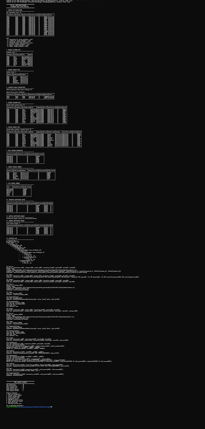

# Day 22 — Batch Mini Project

## E-Commerce Daily Sales Pipeline

This project builds an end-to-end batch data pipeline using Apache Spark and Scala. It reads raw transaction data, removes invalid records, enriches the transactions with customer and product information, calculates revenue summaries, and writes the final daily revenue data as partitioned Parquet.

## Objective

- Read raw e-commerce transactions.
- Clean invalid transactions.
- Join customer and product data.
- Aggregate daily revenue.
- Create year/month/day partition columns.
- Write partitioned Parquet output.
- Read the output back and verify it.
- Inspect the Spark execution plan and identify joins and shuffle stages.

## Project Structure

```text
Day-22-Batch-Mini-Project/
├── build.sbt
├── data/
│   ├── transactions.csv
│   ├── customers.csv
│   └── products.csv
├── output.txt
├── project/
│   └── build.properties
├── screenshots/
│   └── day22-batch-project.png
└── src/
    └── main/
        └── scala/
            └── Day22BatchMiniProject.scala
```

Generated Parquet files are kept locally under `output/` and are excluded from Git.

## Input Data

### Transactions

The raw transaction file contains transaction ID, customer ID, product ID, transaction date, quantity, amount, and status.

The sample contains 16 transactions, including invalid cases such as a negative amount, a cancelled transaction, an unknown customer, and an unknown product.

### Customers

Customer data contains:

- customer_id
- customer_name
- city
- segment

### Products

Product data contains:

- product_id
- product_name
- category

## Pipeline

```text
Raw Transactions
       │
       ▼
Data Cleaning
       │
       ▼
Customer Join
       │
       ▼
Product Join
       │
       ▼
Revenue Aggregation
       │
       ▼
Year / Month / Day Columns
       │
       ▼
Partitioned Parquet
       │
       ▼
Read Back & Verify
```

## Processing Steps

### 1. Read Raw Transactions

Spark reads the CSV transaction data with schema inference and converts `transaction_date` to a date type.

Raw records: **16**

### 2. Clean Invalid Transactions

The pipeline keeps transactions where:

- status = `Completed`
- amount > 0
- quantity > 0
- customer_id is not null
- product_id is not null

After basic validation: **14 records**

Two records were removed during this stage:

- T013 — negative amount
- T014 — Cancelled transaction

### 3. Join Customer Data

An inner join is performed using `customer_id`.

Records after customer join: **12**

The transaction with customer ID C999 is removed because that customer does not exist in the customer dataset.

### 4. Join Product Data

An inner join is performed using `product_id`.

Records after product join: **11**

The transaction with product ID P999 is removed because that product does not exist in the product dataset.

### 5. Daily Revenue Aggregation

The pipeline groups the enriched transactions by `transaction_date` and calculates:

- transaction count
- total quantity
- total revenue

| Date | Transactions | Quantity | Revenue |
|---|---:|---:|---:|
| 2026-09-01 | 2 | 3 | 115000 |
| 2026-09-02 | 2 | 5 | 9500 |
| 2026-09-03 | 2 | 3 | 19000 |
| 2026-09-04 | 2 | 6 | 37500 |
| 2026-09-05 | 2 | 4 | 62500 |
| 2026-09-06 | 1 | 2 | 24000 |

### 6. Revenue Summaries

The project also produces product-level and city-level revenue summaries.

Product revenue includes Laptop, Phone, Monitor, Keyboard, Mouse, and Headphones.

City revenue includes Hyderabad, Bangalore, Chennai, Mumbai, Pune, and Delhi.

### 7. Partitioned Parquet Output

The aggregated daily revenue is given partition columns:

```text
year
month
day
```

The output is written to:

```text
output/daily-revenue/
```

The resulting layout follows the partition structure:

```text
year=2026/
└── month=9/
    ├── day=1/
    ├── day=2/
    ├── day=3/
    ├── day=4/
    ├── day=5/
    └── day=6/
```

Final output records: **6**

## Spark Execution Plan

The physical plan contains:

- `BroadcastHashJoin` for the customer join.
- `BroadcastHashJoin` for the product join.
- `BroadcastExchange` for the small customer and product datasets.
- `HashAggregate` for revenue aggregation.
- `Exchange` stages caused by aggregation/shuffle.
- `Sort` for the final ordered result.

This shows how Spark optimizes the small dimension-table joins using broadcast joins and performs exchanges when data needs to be redistributed for aggregation.

## Performance Notes

- Customer and product datasets are small, so Spark uses broadcast joins.
- Filtering is applied during the transaction scan through pushed filters.
- Aggregation by transaction date creates shuffle/exchange stages.
- Partitioning the final Parquet output by year/month/day helps organize daily data and can reduce the amount of data read when queries filter on partition columns.

## Technologies Used

- Scala 2.12.18
- Apache Spark 3.5.3
- Spark SQL
- sbt 2.0.7
- Java 17
- CSV
- Parquet
- WSL2 / Ubuntu

## Run the Project

From the project directory:

```bash
sbt compile
sbt run
```

To save the complete execution output:

```bash
sbt run > output.txt 2>&1
```

## Final Evidence

| Stage | Records |
|---|---:|
| Raw Transactions | 16 |
| Valid Transactions | 14 |
| After Customer Join | 12 |
| After Product Join | 11 |
| Daily Revenue Records | 6 |
| Final Parquet Records | 6 |

## Screenshot



## Result

The Day 22 batch mini project successfully implements an end-to-end e-commerce daily sales pipeline using Spark and Scala, including data cleaning, enrichment joins, revenue aggregation, partitioned Parquet output, output verification, and execution-plan inspection.

**DAY 22 COMPLETED SUCCESSFULLY**