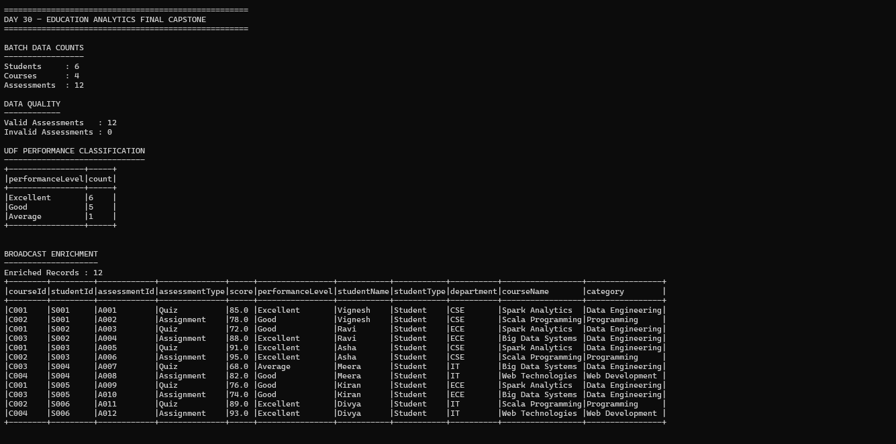
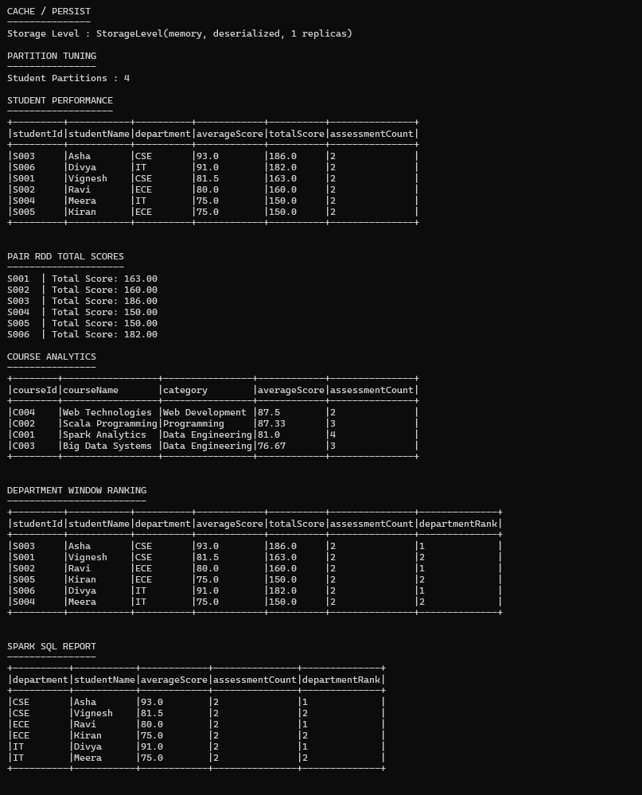
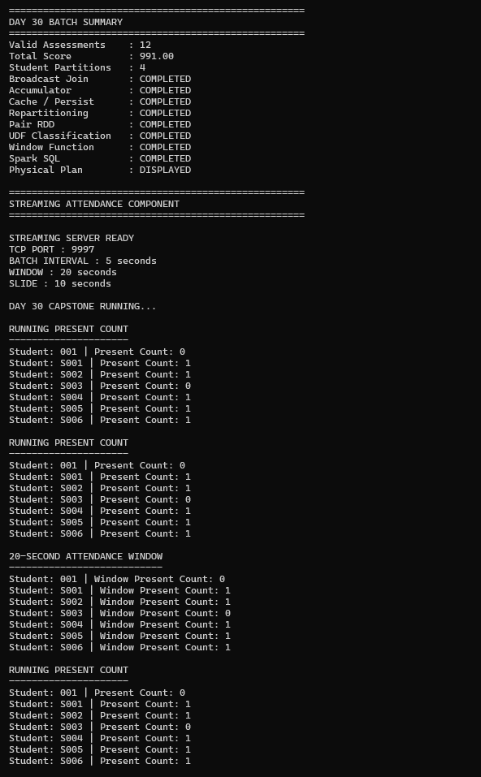

# Day 30 - Education Analytics Final Capstone

## Project Overview

Final capstone using Scala and Apache Spark 3.5.3 to demonstrate batch education analytics and real-time attendance streaming.

### Technologies
- Scala 2.12.18
- Apache Spark 3.5.3
- Spark SQL
- Spark Streaming
- sbt 2.0.7
- Java 17
- Ubuntu / WSL2

## Project Structure

```
Day-30-Education-Analytics/
├── data/
│   ├── students.txt
│   ├── courses.txt
│   ├── assessments.txt
│   └── attendance.txt
├── project/build.properties
├── src/main/scala/Day30EducationAnalytics.scala
├── screenshots/
│   ├── day30-streaming-server.png
│   ├── day30-running-count.png
│   └── day30-window.png
├── build.sbt
└── .gitignore
```

## Batch Analytics

The batch component processes students, courses and assessments and demonstrates:

- Data quality validation
- UDF performance classification
- Broadcast joins
- Accumulator
- Cache / Persist
- Repartitioning and partition tuning
- Pair RDD
- Aggregations
- Window functions
- Spark SQL
- Physical execution plan analysis

### Batch Results

```
Valid Assessments    : 12
Invalid Assessments  : 0
Total Score          : 991.00
Student Partitions   : 4
Broadcast Join       : COMPLETED
Accumulator          : COMPLETED
Cache / Persist      : COMPLETED
Repartitioning       : COMPLETED
Pair RDD             : COMPLETED
UDF Classification   : COMPLETED
Window Function      : COMPLETED
Spark SQL            : COMPLETED
Physical Plan        : DISPLAYED
```

### UDF Classification

| Score | Performance |
|---|---|
| >= 85 | Excellent |
| >= 70 | Good |
| >= 50 | Average |
| < 50 | Needs Improvement |

Result:

```
Excellent : 6
Good      : 5
Average   : 1
```

### Student Performance

| Student | Department | Average | Total |
|---|---|---:|---:|
| Asha | CSE | 93.0 | 186 |
| Divya | IT | 91.0 | 182 |
| Vignesh | CSE | 81.5 | 163 |
| Ravi | ECE | 80.0 | 160 |
| Meera | IT | 75.0 | 150 |
| Kiran | ECE | 75.0 | 150 |

### Department Window Ranking

A `row_number()` window function ranks students within each department.

```
CSE: Asha #1, Vignesh #2
ECE: Ravi #1, Kiran #2
IT : Divya #1, Meera #2
```

### Physical Plan

The physical plan demonstrates operations including:

- BroadcastHashJoin
- BroadcastExchange
- RepartitionByExpression
- InMemoryRelation
- HashAggregate
- Window
- Exchange

## Real-Time Attendance Streaming

The streaming component uses Spark Streaming with a TCP socket.

```
TCP Port       : 9997
Batch Interval : 5 seconds
Window         : 20 seconds
Slide          : 10 seconds
```

### Streaming Architecture

```
Attendance Events
       |
       v
   TCP Socket : 9997
       |
       v
Spark Streaming
       |
       +----------------------+
       |                      |
       v                      v
updateStateByKey      reduceByKeyAndWindow
       |                      |
       v                      v
Running Count          20-Second Window
```

The application maintains running PRESENT counts using `updateStateByKey` and calculates recent attendance using a 20-second window with a 10-second slide.

Example:

```
Student: S001 | Present Count: 1
Student: S002 | Present Count: 1
Student: S003 | Present Count: 0
Student: S004 | Present Count: 1
Student: S005 | Present Count: 1
Student: S006 | Present Count: 1
```

## Screenshots

### Streaming Server


### Running Present Count


### 20-Second Attendance Window


## How to Run

Compile:

```bash
sbt compile
```

Run the application:

```bash
sbt run
```

For streaming, start a TCP listener in another terminal:

```bash
nc -l 9997
```

Then send attendance events through the TCP connection.

## 20 Interview Questions and Answers

### 1. What is the objective of this project?
To build an Education Analytics system demonstrating Spark batch processing, analytics optimization and real-time attendance streaming.

### 2. Why Apache Spark?
Spark provides fast distributed processing and APIs for RDD, DataFrame, SQL and streaming workloads.

### 3. What data is processed?
Students, courses and assessment data are processed in batch, while attendance events are processed in real time.

### 4. What is a DataFrame?
A distributed collection of data organized into named columns with structured operations.

### 5. What is a UDF?
A User Defined Function. This project uses one to classify assessment scores.

### 6. Why use broadcast joins?
To efficiently join small datasets with larger datasets by broadcasting the small side to executors and reducing shuffle.

### 7. What is an accumulator?
A shared Spark variable used to aggregate information from worker tasks. This project counts invalid assessments with one.

### 8. What is cache/persist?
It stores a computed dataset so it can be reused without recomputing its full lineage.

### 9. Why repartition?
To change partition distribution. This project repartitions by `studentId` into four partitions.

### 10. What is a Pair RDD?
An RDD containing key-value pairs. Here `studentId` is the key and scores are aggregated as values.

### 11. What is a window function?
It performs calculations across related rows without collapsing them. This project uses `row_number()` for department ranking.

### 12. Why Spark SQL?
It provides SQL-based querying over structured Spark data and simplifies analytical reporting.

### 13. What is a physical plan?
It describes how Spark will actually execute a query, including joins, exchanges, scans and aggregations.

### 14. What is BroadcastHashJoin?
A join strategy where a small dataset is broadcast to executors and used for hash-based joining.

### 15. What is Spark Streaming?
A streaming framework that processes continuously arriving data in small batches.

### 16. What is updateStateByKey?
A stateful streaming operation that maintains information across batches. Here it maintains running PRESENT counts.

### 17. What is a sliding window?
A time-based view of recent streaming data. This project uses a 20-second window sliding every 10 seconds.

### 18. Running count vs window count?
Running count maintains accumulated state, while window count considers only events inside the configured recent time window.

### 19. How was partition tuning verified?
The application reports four student partitions and the physical plan contains `Exchange hashpartitioning(studentId, 4)`.

### 20. What Spark concepts are demonstrated?
RDD, DataFrame, Spark SQL, UDF, broadcast join, accumulator, cache/persist, repartitioning, Pair RDD, aggregation, window functions, physical plans, Spark Streaming, stateful streaming and sliding windows.

## Final Result

The Day 30 capstone successfully demonstrates both batch and real-time education analytics using Apache Spark.
